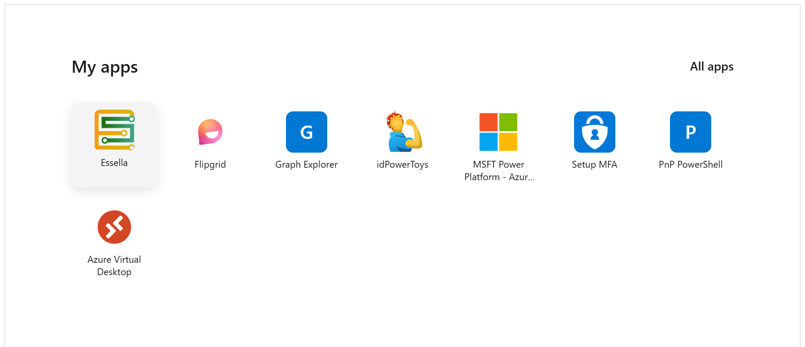

# <picture><source media="(prefers-color-scheme: dark)" srcset="docs/images/icon-dark.svg"></picture> My Enterprise Apps

## Summary

A SharePoint Framework webpart that displays enterprise applications from Microsoft Entra ID (formerly Azure AD) that the current user has access to. This solution leverages the Microsoft Graph API to dynamically retrieve and display Entra enterprise apps with customizable sorting, icon sizes, and the ability to show or hide hidden applications.

## Screenshot

## Video

https://github.com/user-attachments/assets/6cd1f83f-80c3-4986-b193-1923b633b056

## Features

The Entra Enterprise Apps webpart provides the following functionality:

- Integration with Microsoft Graph API to retrieve enterprise applications
- Configurable icon sizes (small, normal, large, huge)
- Option to show or hide hidden applications
- Display of Entra ID applications with custom sorting capabilities
- Localization support (English and Dutch)
- Custom property pane configuration for administrators

## Configuration

The webpart can be configured through the property pane with the following options:

- **Title**: Custom title for the webpart
- **Sort Order**: Enter app-name keywords (one per line) to prioritize apps matching those terms
- **Show Hidden Apps**: Toggle to display or hide hidden enterprise applications
- **Icon Size**: Choose from small, normal, large, or huge icon sizes

## Installation and Upgrades

### Download or compile
[Download the latest release](https://github.com/DwayneSelsig/spfx-my-enterprise-apps-webpart/releases) or compile the solution (`npm run build`). The `.sppkg` file will be in `sharepoint/solution/`.

### Installation
Go to the [SharePoint admin center → **More features**](https://go.microsoft.com/fwlink/?linkid=2185077) → **Apps** → **Open** → **Upload** the `.sppkg` file. Approve Microsoft Graph permissions (`User.Read` and `Application.Read.All`) when prompted.

### Upgrades
Upload the new `.sppkg` file and overwrite the existing one when prompted.

> **Note:** SharePoint add-ins are being retired, but SharePoint Framework (SPFx) solutions like this one are not affected and remain fully supported.

For more information, see the SharePoint App Catalog documentation:
https://learn.microsoft.com/sharepoint/use-app-catalog

## Contributing

We welcome contributions from the community! Here are some ways you can help:

- **Translations**: Help translate the webpart into additional languages. The current supported languages are English and Dutch. If you'd like to contribute translations, please submit a pull request with the updated localization files in the `loc` folder.
- **Feature Suggestions**: Have an idea for a new feature or improvement? Please open an issue to share your suggestion. We'd love to hear about features you'd like to see in the Entra Enterprise Apps webpart.

## Solution

| Solution    | Author(s)                                               |
| ----------- | ------------------------------------------------------- |
| spfx-my-enterprise-apps-webpart | Dwayne Selsig |

## Version history

| Version | Date             | Comments        |
| ------- | ---------------- | --------------- |
| 0.5.0.0 | 2025-12-25          | Initial release |
| 0.6.0.0 | 2026-01-01          | Added Microsoft Apps |
| 0.6.1.0 | 2026-05-25       | Upgraded to SPFx 1.23.0 |
| 0.7.0.0 | 2026-08-27       | Added end-user filtering and custom app sizing; updated SPFx packages and Copilot logo |
| 0.8.0.0 | 2026-08-30       | Added app detail view, configurable default apps and property-pane toggles; improved default icons, Teams link and localization |

## Used SharePoint Framework Version

## Applies to

- [SharePoint Framework](https://aka.ms/spfx)
- [Microsoft 365 tenant](https://docs.microsoft.com/sharepoint/dev/spfx/set-up-your-developer-tenant)

> Get your own free development tenant by subscribing to [Microsoft 365 developer program](http://aka.ms/o365devprogram)

## Prerequisites

Before getting started, ensure your development environment is properly set up by following the [SharePoint Framework development environment setup guide](https://learn.microsoft.com/en-us/sharepoint/dev/spfx/set-up-your-development-environment).

Additional requirements:
- Node.js version 22.14.0 or higher (and lower than 23.0.0)
- Appropriate Microsoft Graph permissions configured in the tenant
- Access to a SharePoint site where the webpart can be deployed

## Disclaimer

**THIS CODE IS PROVIDED _AS IS_ WITHOUT WARRANTY OF ANY KIND, EITHER EXPRESS OR IMPLIED, INCLUDING ANY IMPLIED WARRANTIES OF FITNESS FOR A PARTICULAR PURPOSE, MERCHANTABILITY, OR NON-INFRINGEMENT.**

---

## Minimal Path to Awesome

- Clone this repository
- Ensure that you are at the solution folder
- In the command-line run:
  - `npm install @rushstack/heft --global`
  - `npm install`
  - `npm run start`

Other build commands can be listed using `heft --help`.

To build the solution for production:
- `npm run build`

## Microsoft Graph Permissions

This solution requires the following Microsoft Graph permissions:

- `User.Read` - To read the current user's profile
- `Application.Read.All` - To read all enterprise applications (requires admin consent)
  
`User.Read` is covered by basic sign-in/profile consent; `Application.Read.All` must be approved by a tenant admin via the API access page or enterprise app consent.

## Enterprise application selection and privacy

`/me/appRoleAssignments` remains the source of truth for applications available to the current user, but it cannot identify Enterprise Applications that are present in the tenant and assigned to nobody. The webpart therefore also reads paged `servicePrincipals` results, restricted to both `servicePrincipalType eq 'Application'` and the `WindowsAzureActiveDirectoryIntegratedApp` tag. Both conditions are required: the type excludes `ServiceIdentity` (including Entra Agent Identities), while the tag excludes Microsoft infrastructure and backend service principals without relying on app names, publishers, or maintained blacklists.

For an Integrated App that is not in the current user's assignments, the webpart checks `appRoleAssignedTo`. Only a successful response with an empty `value` array means that the app is unassigned and can be shown. An app with any assignment (user, group, or service principal) is not shown to users who do not have it themselves.

These checks use Microsoft Graph `/$batch`, with at most 20 `appRoleAssignedTo` requests per batch. The first page requests only one assignment because the check only needs to distinguish empty from non-empty results. Batch subrequest failures and other unknown assignment states are handled fail-closed: the affected app is not shown. Existing `HideApp` and **Show Hidden Apps** behavior is applied after this selection.

There is no webpart-specific automated test suite yet. When validating a tenant manually, check that an app assigned to the current user and an unassigned Integrated App are shown; apps assigned only to another user or group are not shown; `HideApp` follows **Show Hidden Apps**; `ServiceIdentity` and non-tagged `Application` service principals are excluded; a candidate set of 20 and 21 apps produces one and two batches respectively; paged service-principal results are complete; and a failed batch subrequest does not expose its app.

## References

- [Getting started with SharePoint Framework](https://docs.microsoft.com/sharepoint/dev/spfx/set-up-your-developer-tenant)
- [Building for Microsoft Teams](https://docs.microsoft.com/sharepoint/dev/spfx/build-for-teams-overview)
- [Use Microsoft Graph in your solution](https://docs.microsoft.com/sharepoint/dev/spfx/web-parts/get-started/using-microsoft-graph-apis)
- [Publish SharePoint Framework applications to the Marketplace](https://docs.microsoft.com/sharepoint/dev/spfx/publish-to-marketplace-overview)
- [Microsoft 365 Patterns and Practices](https://aka.ms/m365pnp) - Guidance, tooling, samples and open-source controls for your Microsoft 365 development
- [Heft Documentation](https://heft.rushstack.io/)
- [Microsoft Entra ID Documentation](https://learn.microsoft.com/en-us/entra/)

Icon from [Microsoft Fluent UI System Icons](https://github.com/microsoft/fluentui-system-icons) (MIT License)
